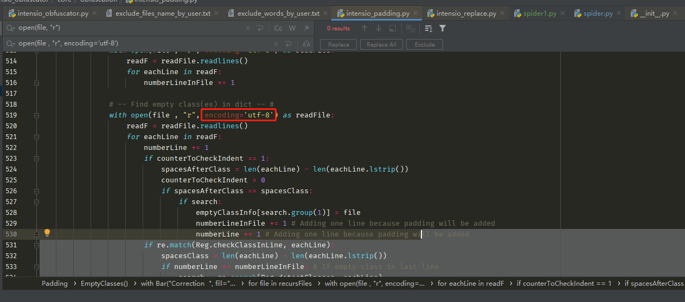

1. pip install intensio-obfuscator
2. cd到intensio-obfuscator的安装目录例如：F:\develop\python\venvs\spider_env\Lib\site-packages\intensio_obfuscator
3. python intensio_obfuscator.py -i F:\develop\python\earn\obfuscator-tools\raw -o F:\develop\python\earn\obfuscator-tools\obfuscator -mlen lower -ind 4 -rts --excludewords exclude_examples/exclude_words_by_user.txt
4. 第三步的命令解释：
   python 混淆处理脚本 -i 原始文件存放的目录 -o 混淆后的文件输出目录 -mlen 随机字符串长度[lower:32 | medium:64 | high:128] -ind 缩进长度 --excludewords 不需要混淆的单词组成的文件
5. 命令执行的过程中可能会出现报错：UnicodeDecodeError: 'gbk' codec can't decode byte 0xad in position 76: illegal multibyte sequence，需要修改intensio-obfuscator源码，将所有文件读取的代码中加上参数“encoding='utf-8'”
   如下图：
   1. 
6. 注意要点：源代码中不要用f-string的方式格式化字符串；把第三方包需要的参数名加入到“不需要混淆的单词组成的文件”