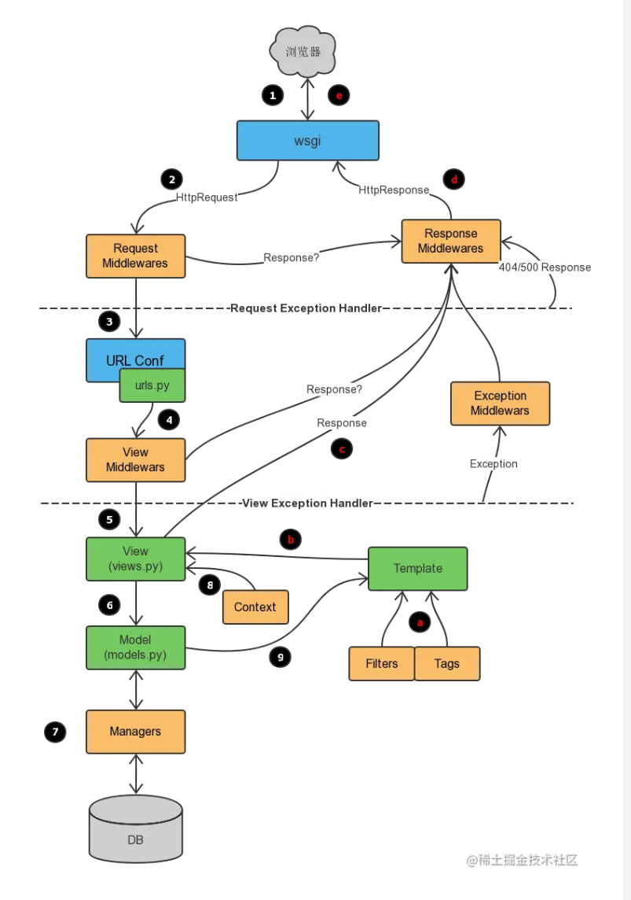
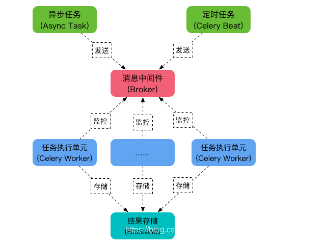

python篇
1. python中进程，线程，协程
2. python的垃圾回收机制
3. python缓存池机制
4. 字典的底层原理

django篇
1. django的生命周期

2. django中间件的使用
    process_request, process_view, process_response, process_exception
3. django session的设计原理
  1 如果用户是第一次请求（就看客户端ie是否保存了session ID的cookie）
    创建session model
       生成一个key session 随机的一个字符串 uuid
       保存到你session_engine指定的位置
       保存到cookie中，在用户的浏览器中   
    如果第二次以上的请求，客户端ie都会制动提交cookie到django,django中利用你配置的
    SessionMiddleware中间件**session利用cookie中的sessionID到你session_engine指
    定的位置读取session model
    并设置到request的session属性上
    正是因为这样你才能在你的view里面通过request.session中使用session能力
    session本身就是一个dict字典
    session再存数据必须支持序列化json
4. 请解释 Django REST framework（DRF）并列举其主要特点。
Django REST framework是一个基于Django的强大RESTful API框架。它使创建RESTful API变得容易，并提供了许多功能，例如自动生成API文档、视图类和
认证等。
5. 为什么要使用framework框架？
不是必须要使用，只不过使用了视图类可以更加的规范，让我们前后端降低耦合性，更加安全快捷。
增删改查的实现流程基本一样，使用视图类可以更快捷的开发。
在序列化的时候，操作数据不同，但是流程相似，可以继承 serializers.ModelSerializer类简写
6. class View(object):

class APIView(View): 
    # 封装了view,并且重新封装了request,初始化了各种组件
     提供了免除csrf认证，版本处理、认证、权限、节流、解析器、筛选器、分页、序列化、渲染器

class GenericAPIView(views.APIView):
    # 增加了一些属性和方法,如get_queryset,get_serializer

class GenericViewSet(ViewSetMixin, generics.GenericAPIView)
    # 父类ViewSetMixin 重写了as_view,返回return csrf_exempt(view)
    # 并重新设置请求方式与执行函数的关系
class ModelViewSet(mixins.CreateModelMixin,
                   mixins.RetrieveModelMixin,
                   mixins.UpdateModelMixin,
                   mixins.DestroyModelMixin,
                   mixins.ListModelMixin,
                   GenericViewSet):
   # 继承了mixins下的一些类,封装了list,create,update等方法，还继承了GenericViewSet
7. nginx中proxy_pass和uwsgi_pass的区别
proxy_pass 和 uwsgi_pass 都是 Nginx 中用来进行反向代理的指令，但是它们的作用和应用场景是不同的。
proxy_pass 主要用于反向代理 HTTP 或 HTTPS 请求，将请求转发给后端的 HTTP 或 HTTPS 服务器，后端服务器可以是运行在本机或者其他机器上的任意 Web 服务器，例如 Apache、Tomcat 等等。这样可以通过 Nginx 反向代理的方式来实现负载均衡、缓存、SSL 加密等功能。
uwsgi_pass 则主要用于反向代理与 uWSGI 进程通信的请求，它把请求直接传递给后端的 uWSGI 应用服务器，用于实现动态 Web 应用程序的部署和管理。使用 uwsgi_pass 配置 uWSGI 服务器可以更加灵活地控制 uWSGI 进程的启动、停止和重启，并可以动态调整 uWSGI 进程的数量，从而更好地实现负载均衡和高可用性

celery篇
celery官方定义为分布式任务队列,由三部分组成“消息中间件broker(redis, rabbitmq)” + "workers(任务执行单元)" + "任务结果存储"

任务模块 Task
包含异步任务和定时任务。其中，异步任务通常在业务逻辑中被触发并发往任务队列，而定时任务由 Celery Beat 进程周期性地将任务发往任务队列。
消息中间件 Broker
Broker，即为任务调度队列，接收任务生产者发来的消息（即任务），将任务存入队列。Celery 本身不提供队列服务，官方推荐使用 RabbitMQ 和 Redis 等。
任务执行单元 Worker
Worker 是执行任务的处理单元，它实时监控消息队列，获取队列中调度的任务，并执行它。
任务结果存储 Backend
Backend 用于存储任务的执行结果，以供查询。同消息中间件一样，存储也可使用 RabbitMQ, redis 和 MongoDB 等。